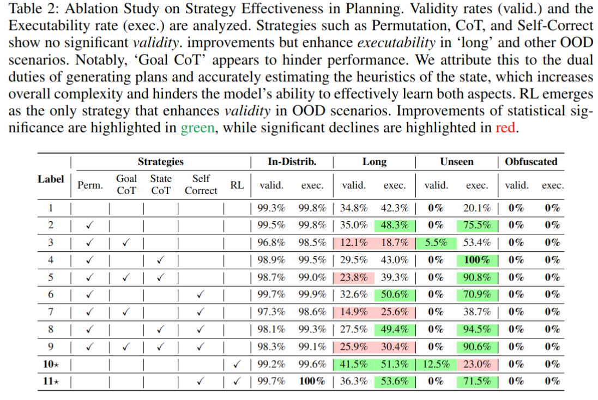

# Revisiting Strategies for End-to-End LLM Plan Generation

Not Finished Yet



This repository contains the codebase for the paper **Chasing Progress, Not Perfection: Revisiting Strategies for End-to-End LLM Plan Generation**

> **TL;DR** Our study challenges prevailing views on LLMs' planning abilities. While fine-tuning on planning data alone doesn't yield robust skills, strategies to enhance LLM reasoning indeed made progress towards better plan quality, evidenced by increase of executability rate.


> [!IMPORTANT]
> This project utilizes the Kedro framework to enhance code modularity and ensure **reproducibility** to the greatest extent possible. If you encounter any issues related to **reproducibility**, please report them to the authors.


## Directory Structure

```bash
📂 .
├── 📂 conf # configuration files, make sure you check and modify them before running the experiments
├── 📂 data
│   ├── 📂 03_primary
│   │   └── 📂 llm_plan_generation_dataset_qwen # store the training dataset (incomplete for this repo)
│   └── 📜 READMD.md
├── 📂 opt
│   ├── 📂 VAL  # pddl validator 
│   └── 📂 planning-as-a-service    # pddl planner service
├── 📂 src
│   ├── 📂 better_language_model_for_plan_generation
│   │   ├── 📂 pipelines
│   │   │   ├── 📂 further_ppo_training # further RL training for llm planner
│   │   │   ├── 📂 language_model_planning_evaluation   # evaluation of the trained llm planner
│   │   │   ├── 📂 plan_validation_probing  # probing test to check if model can identify mistakes correctly
│   │   │   ├── 📂 text_prompt_generation   # generate training dataset
│   │   │   └── 📂 training_llm_for_plan_generation # deprecated, we now use llama factory rather than hard coding the training process
│   │   └── 📂 utils    # other useful methods such as calling the planner 
└── 📂 zjob-scripts  # scripts for running the experiments
```

> [!TIP]
> There are readme files in the subdirectories of the project. Please refer to them for more detailed information.


## Installation Steps
```bash
conda create --name=btrlmplan python=3.11
conda activate btrlmplan
# change directory to the project root
pip install -e .
```

## How to Run
To run the experiments, we recommend checking the `zjob-scripts` directory for the scripts to run the experiments. 

Make sure the root directory is the project root directory. Do not run the scripts from the `zjob-scripts` directory.

- Data Preparation: `zjob-scripts/step_1_huggingface_dataset_creation.sh`
- Training LLM for Plan Generation: `zjob-scripts/step_2_training_llm_for_plan_gen.sh`
- Evaluation of LLM for Plan Generation: `zjob-scripts/step_3_llama_fac_lm_planning_evaluation.sh`
- Probing LLM for Mistake Recognition: `zjob-scripts/step_4_lm_planning_probing.sh`
- RL Training for Plan Generation: `zjob-scripts/step_5_ppo_further_training.sh`

> [!NOTE]
> Most of our experiments are run with 4x A100 GPUs. Please adjust the batch size and gradient accumulation steps accordingly if you have different hardware.


## Known Issues
### Plan Generation Data is Not Ready
Due to storage limitations, we are unable to provide the plan generation dataset. However, you can use the scripts to generate the dataset.
Before generating the dataset by yourself, please make sure you setup the following stuffs:
1. make sure the `planning-as-a-service` is running, you can run `src/better_language_model_for_plan_generation/utils/call_planning_as_service.py` to check if the service is running. Make sure `http://localhost:5001/package/lama-first/solve` is accessible.
2. Make sure you have 100+ GB of free space in your disk. The data generation process will took 24+ hours to finish.